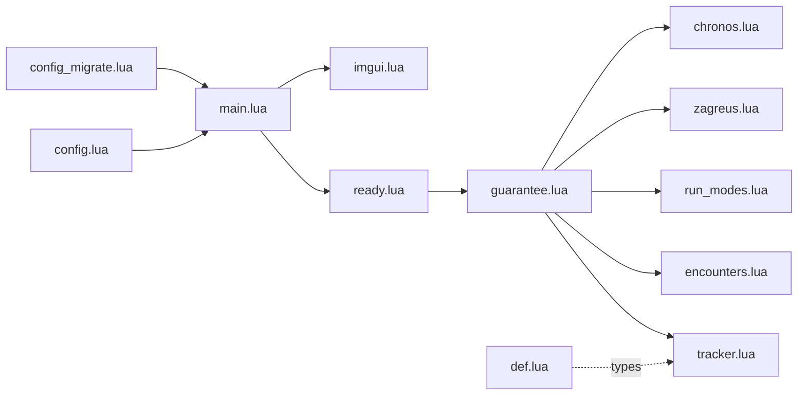

# Contributing to Fated Encounters

Thanks for helping improve the mod. This guide is for **code and docs pull requests**—local setup, change expectations, and how to open a PR.

For bugs and feature ideas, see **[README → Support](README.md#support)** (issue templates). Small typos or docs-only fixes can skip a prior issue.

## Before you start

- Read the [README](README.md)—especially **How it works** and **Settings reference**—so you understand once-per-run guarantees and the in-game settings window.
- Install or update from [Thunderstore](https://thunderstore.io/c/hades-ii/p/MarcoAntolini/FatedEncounters/) (r2modman or Thunderstore App).
- Join the [Hades II Modding Discord](https://discord.gg/KuMbyrN) for general Hell2Modding help (optional).

## Development setup

1. **Requirements:** A legal copy of Hades II, [Hell2Modding](https://thunderstore.io/c/hades-ii/p/Hell2Modding/Hell2Modding/) (via r2modman is easiest), and [Fated Encounters](https://thunderstore.io/c/hades-ii/p/MarcoAntolini/FatedEncounters/) with its dependencies (see `thunderstore.toml`).
2. **Clone** this repository and open it in your editor (VS Code + [Lua](https://marketplace.visualstudio.com/items?itemName=sumneko.lua) extension recommended; workspace settings predefine mod globals).
3. **Symlink for live reload** — link this repo’s `src` folder into your r2modman profile so edits apply without rebuilding the package every time:

   ```powershell
   New-Item -ItemType SymbolicLink `
     -Path "$env:APPDATA\r2modmanPlus-local\HadesII\profiles\Default\ReturnOfModding\plugins\MarcoAntolini-FatedEncounters" `
     -Target "C:\path\to\Fated-Encounters\src"
   ```

   Adjust the profile path if you use a non-default profile. On Linux or macOS, see the [mod template / dev environment](https://sgg-modding.github.io/Hades2ModWiki/docs/creating-mods/development-environment) on the Hades II Mod Wiki.

4. **First-time symlink setup:** Copy `icon.png`, `LICENSE`, and a `manifest.json` from a `tcli build` output into `src` if r2modman expects them (see wiki). Add those copies to `.gitignore` paths already listed for `src/`.

5. **Test in-game** with your change loaded—use the **Fated Encounters** settings window or r2modman Config. Enable `debugLog` when debugging guarantee logic.

## Making changes

- **Scope:** Keep PRs focused. Match existing Lua style and naming in `src/`.
- **Config:** New user-facing options need defaults in `src/config.lua` (defaults + `descript`), updates to the in-game settings UI in `src/imgui.lua`, a row in the README **Settings reference** table, and a Chalk `version` bump when merging new keys into existing `.cfg` files. If the bump renames or moves keys, add a step in [`src/config_migrate.lua`](src/config_migrate.lua) so existing saves upgrade cleanly.
- **Changelog:** Add a bullet under a new `## [Unreleased]` section at the top of [CHANGELOG.md](CHANGELOG.md) (create the section if missing). Maintainers fold that into a versioned release.
- **API:** Document public fields for other mods in [`src/def.lua`](src/def.lua).
- **Do not** commit secrets, local `.cfg` files, or `build/` artifacts.

## Documentation

Docs are layered by audience. Do not paste README copy into Lua, and do not add paragraph headers to every file.

### Where things live

| Audience | Location | What to write |
|----------|----------|---------------|
| Players | README, CHANGELOG (user bullets), `thunderstore.toml`, ImGui labels, `config.lua` `descript` | Behavior, defaults, and settings in plain language ([user-friendly terms](.cursor/rules/user-friendly-docs.mdc)) |
| Other mods | [`src/def.lua`](src/def.lua) | Config types, run-state shape, and `mod.*` exports |
| Contributors | This file + one-line `src/*.lua` headers | Module role, non-obvious hook logic, migration notes |

### `src/` module map



| File | Role |
|------|------|
| `main.lua` | Entry: Chalk config, ReLoad early/late lifecycle, `public.config` |
| `ready.lua` | One-time imports and hook registration |
| `reload.lua` | Reload-safe import stub (bodies in feature modules) |
| `ready_late.lua` / `reload_late.lua` | Reserved late-load slots (empty today) |
| `config.lua` | Defaults + r2modman `descript` strings |
| `config_migrate.lua` | Upgrade old `.cfg` when `version` bumps |
| `def.lua` | EmmyLua types and cross-mod API notes |
| `encounters.lua` | Ally encounter names, biomes, eligibility helpers |
| `run_modes.lua` | Chaos Trials / Dream Dives detection and gating |
| `tracker.lua` | Per-run `run.FatedEncounters` state |
| `guarantee.lua` | Ally forcing via `ChooseEncounter` / `IsEncounterEligible` |
| `zagreus.lua` | Infernal Contract guarantee |
| `chronos.lua` | Reformed Chronos hub guarantee |
| `imgui.lua` | In-game settings; syncs with r2modman via Chalk |

### Lua file conventions

Every `src/*.lua` file starts with:

```lua
---@meta _
-- One line: what this module owns.
```

Use `---@meta MarcoAntolini-FatedEncounters` only in [`def.lua`](src/def.lua) (published types).

[`config.lua`](src/config.lua) uses a plain `--` header only (Chalk data module; no plugin globals).

**Add EmmyLua (`---@param`, `---@return`, `---@class`) when:**

- The function is exported on `mod.*` or called from another module
- Parameters or return values are not obvious from names alone
- You introduce a new config or run-state shape (define types in `def.lua` first)

**Add inline `--` comments only when:**

- Explaining a game quirk (cooldown stripping, intro swaps, empty rooms, dream-run blocks)
- Documenting a migration step in `config_migrate.lua`
- Describing non-obvious sync behavior (ImGui debounce / disk poll)

**Skip comments on:** bootstrap wiring (`main.lua` imports), obvious getters, and thin stubs (`reload.lua`).

### New user-facing options

1. Defaults + `descript` in `config.lua`
2. ImGui control in `imgui.lua` (section names players see)
3. Row in README **Settings reference**
4. CHANGELOG bullet under `[Unreleased]`
5. Bump `config.version` and add a step in `config_migrate.lua` if keys move or rename
6. Update `def.lua` if the config shape changes

### New cross-mod surface

If another mod needs to read state or hook alongside this one, expose it on `mod.*` and document it in the block comment at the bottom of `def.lua`.

## Pull requests

1. Fork and branch from `main`.
2. Fill out the [pull request template](.github/pull_request_template.md).
3. Ensure the mod still loads with r2modman and your described test steps pass.
4. Open the PR; link any related issue.

Maintainers may request changes or handle versioning and Thunderstore releases.

## Releases (maintainers)

Before running the GitHub Actions **Release** workflow, cut the release locally (versioned `CHANGELOG.md` section, empty `## [Unreleased]`, and `versionNumber` in `thunderstore.toml` bumped to the tag). The workflow builds and publishes to [Thunderstore](https://thunderstore.io/c/hades-ii/p/MarcoAntolini/FatedEncounters/), tags the repo, and uses the matching `CHANGELOG.md` section for GitHub release notes. README images under `./images/` are rewritten to GitHub raw URLs during the build only—keep `images/icon.png` in sync with root `icon.png`.

## Questions

For loader, dependency, or general modding questions, the [Hades II Modding Discord](https://discord.gg/KuMbyrN) is usually fastest. For behavior specific to this mod, open a [GitHub issue](https://github.com/MarcoAntolini/Fated-Encounters/issues) (bug or feature template is fine if you are not sure which fits).
